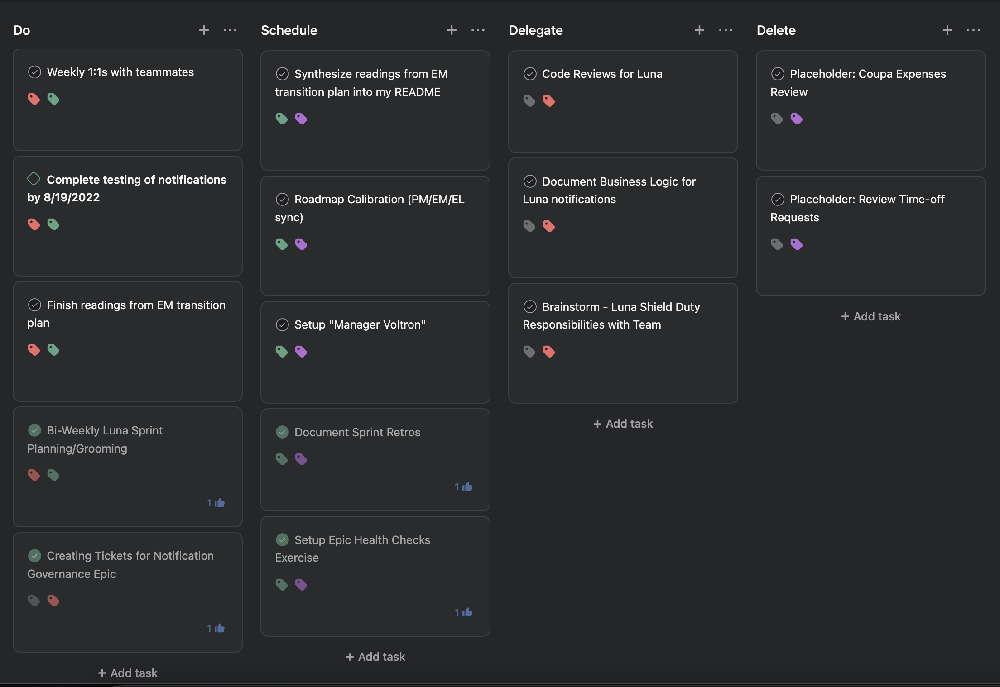

# Project: Engineering Manager Transition 🔢

> This is a personal record of my activities, events and learnings that will help foster an EM mindset. -  Chris Ngo

### Usage
Employ this document to keep track and plan ahead on weekly objectives. Make time to fill this out at the end of every work-week to validate current progress, jot down nuggets of knowledge and schedule for the next cadence. This will likely start out as a place for task and notes. Ideally, with enough organization and content, this will become my own knowledge base.

---

### Contributing
This document will be updated regularly. We should get in the habit of creating a new section for the upcoming work week. This will give us a headstart on thinking through our next objectives and optimize our own flow-states.

##### 8/22/2022 - 8/28/2022
##### Theme: Putting it into Practice (Continued)
##### User Stories:
- [ ] Discuss Resilient Management (Continued)
    - Ask for advice about communicating uncomfortable news, reassuring teammates when unexpected events arrive, how to formulate message to attune to all core BICEPS. Building resiliency.
- [ ] Manager Training - Coaching Skills
- [ ] Revisit Radical Candor by Kim Scott
- [ ] Get to know my <strong>"first team"</strong> (my peers that have more/similar experience) and offer my support where I can. Build up the Manager Voltron.
- [ ] Read and Disucss [The Gorilla Tax thread](https://twitter.com/shreyas/status/1332065861813694465?s=21&t=0Dk6Y-PZFqMQvFE00vkytg)

___

##### 8/15/2022 - 8/21/2022
##### Theme: Putting it into Practice (Continued)
##### User Stories:
- [x] Discuss Resilient Management (Continued)
- [ ] Read and Discuss [Radical Delegation](https://twitter.com/shreyas/status/1492345230720331779?s=21&t=0Dk6Y-PZFqMQvFE00vkytg)
- [ ] Read and Discuss [Product-Minded Engineer](https://blog.pragmaticengineer.com/the-product-minded-engineer/)
- [x] Setup personal Eisenhower Matrix

##### Notes #####
- Led Sprint Planning and Scrum Ceremonies.
- Observed Europa Grooming and shadowed Vinoj.
- Had informative 1:1s with Luna teammates.
- Created my own Eisenhower Matrix and prioritized my tasks accordingly for the current sprint. This exercise was enlightening. I naturally am inclined to feeling like everything is Urgent and Important, but this helped me get a better of sense of my unique role and what tasks I should do to best help my team. Learning how to delegate is a skill I will continue to build on.
    > Delegating tasks is one of the most efficient ways to manage your workload and give your team the opportunity to expand their skill set.
- This board currently lives in Asana, I will try to maintain it every sprint, making adjustments where needed. Tasks like Weekly 1:1s with teammates will always be in the Do section.

---

##### 8/8/2022 - 8/14/2022
##### Theme: Putting it into Practice
##### User Stories:
- [x] Discuss Resilient Management (Continued)
- [x] Read and Discuss [Product vs Feature Teams](https://www.svpg.com/product-vs-feature-teams/)
- [x] Meet with teammates over 1:1s to acknowledge role change and our new work-relationships. Vocalize my support for their careers. 
- [x] Corroborate with each teammate on their 1:1 schedule and format. Briefly go over 1:1 template and gather feedback on its effectiveness. Learn more about each teammates core-needs by employing some [Questions for our first 1:1](https://larahogan.me/blog/first-one-on-one-questions/) from Lara Hogan's Resilient Management.

##### Notes #####
- Led Backlog Grooming and Scrum Ceremonies.
- Facilitated roadmap calibration (EM/EL/PM sync).
- Observed Europa Sprint Planning and shadowed Vinoj.
- Translated a new high-priority objective from Product leadership into an epic. Communicated new epic to teammates, provided context on the problem-statement and clarity on why we've prioritized this over WIP. Collaborated with teammates to iron-out an ERD and action-plan that will be executed over phases - Luna engineers formulated their own SWAG based off their understanding of the required scope.
- In [Product vs Feature Teams](https://www.svpg.com/product-vs-feature-teams/), Marty Cagan describes how top-down decision-making can create dehabilitating consequences to teams.
    > "When you’re given output to deliver you are not empowered in any meaningful sense."
- <strong>In a "feature team", their stakeholders make the decisions on what to work on.</strong> They will say something like "build this feature because it delivers value to the business." Unfortuantely, in this type of relationship, stakeholders will still find a way to blame the team if their hoped-for results are not realized. Each member of the squad is negatively affected:
    - Product Managers devolve into project managers. They are <strong>stressed by this unfair reality and push for output instead of creating value for the customer.</strong> This manifests as a "show that you are busy" mindset.
    - Product Designers become graphic designers. They feel <strong>pressured to deliver designs that closely align with leadership's high-level vision.</strong> They don't have the opportunity to think and end up neglecting the app's usability and experience.
    - Engineers are <strong>regulated to an arm of execution and have little input on the "Why" for decisions.</strong> This creates a contentious relationship with Product. Both parties see each other more as obstacles rather than a contributing partner.
- In summary, "Product teams" degenerate into "Feature teams" when <strong>they don't have the agency to formulate their own priorities and make collaborative decisions.</strong> They don't feel like they own their product.
- :memo: **Exercise**: How would you indoctrinate an engineer who has never been on a "Product Team"?
    >  
    > 
One of the best actions we can take is to keep them informed, always. Engineers are <strong>motivated when they have a say</strong>, but first we need to provide them the necessary context to formulate their own perspectives. Share why decision were made, why they matter - then be open to address their feedback. Establishing this line of communication sets the foundation for a two-way conversation.

    > 
<strong>Be a Listener!</strong> Ultimately, we want our teammates to feel like they belong and that their opinions do matter in the execution of our goals. We can start breaking that ice in our 1:1s, which is arguably the most powerful method in our arsenal. We can learn a great deal by simply asking questions to get to know them better.

    > 
Wnat do you enjoy most about being an engineer?

    > 
What do you like about the product/feature that you're working on?

    > 
What don't you like about it? What are some cool enhancements you'd like to make?

    > 
These are concrete conversations that we can have to <strong>better understand their point of view and help foster any ideas that require feedback or affirmation.</strong> In doing so, we help build their self-assurance (Am I competent?), familiarity with their work (Am I on the right track?) and overall psychological safety (Am I valued?). <strong>Gradually, our "new" engineers will feel more empowered to discuss and share their perspectives with a larger audience, our collective team.</strong> They begin to indoctrinate themselves.

    >  
- :tada: **Reflection**: This was my first week having 1:1s with my teammates as their EM. Previously, I had weekly 1:1s with them as a peer. It genuinely feels different, but in a good way! This time was usually spent helping them remove any blockers and gathering feedback on anything they wanted to chat about. This time, the conversations were more fluid and my teammates were engaged in asking questions outside of their WIP. I believe some ambiguity existed in our prior meetings as to their intended purpose. This week, I took care to endorse our new work relationships and corroborate on preferable 1:1 schedules/formats. I also employed the [Questions for our first 1:1](https://larahogan.me/blog/first-one-on-one-questions/) from Lara Hogan's Resilient Management. My teammates were really open to answering them and I'm fortuante to learn what they care about!

---

##### 8/1/2022 - 8/7/2022
##### Theme: Getting Started (Continued)
##### User Stories:
- [x] Discuss Resilient Management
- [x] Read and Discuss [Empowered Product Teams](https://www.svpg.com/empowered-product-teams/)
- [x] Organize Calendar by Energies to get into Flow.

##### Notes #####
- Led Sprint Planning and Scrum ceremonies.
- :memo: **Exercise**: What do I optimize for? What do I hope my teammates will lean on me for?
    >  
    > 
I'm a thoughtful leader  who <strong>values clarity and shared understanding.</strong> You'll see this when I communicate progress and information. I support my team by being <strong>attuned to their perspectives</strong> and I stay aligned with company values by putting the customer first when making decisions. I thrive in a <strong>predictable and goal-oriented environment.</strong> I commit to being <strong>transparent, emotionally adaptive and customer-centric.</strong>

    >  
     
- :bulb: **Tip:** The best feedback is specific, actionable, and delivered in a way that ensures the receiver can actually absorb it.
    - Observation of behavior + Impact of behavior + Request or Question = Specific, Actionable Feedback
        - <strong>Problem Statement</strong>: Someone on your team is writing super-short emails.
        - <strong>Observation</strong>: Over the last few weeks, I’ve noticed that your emails to me contain fewer than five words on average.
        - <strong>Impact</strong>: This adds much more time to the overall process of us communicating.
        - <strong>Question</strong>: Can you help me understand what you’re optimising for? <i>Follow that up with:</i> How can we come to a compromise going forward?
     
- :memo: **Exercise:** Organize scheduled events and activites by energies/color. This will help identify your context-switching habits and opportuniies to optimize your flow-state.
    >  
    > 
Blue: Pod Ceremonies (Planning, Grooming, Standup)

    > 
Yellow: Calibrating (PM-EM sync, Team-leads sync, pod brainstorming)
 
    > 
Green: 1:1s (Direct-reports, Manager, Skip-level)

    > 
Lavendar: Blocked-off Time (deep-thinking, learning, flow)

    > 
Pink: Peer & Goal Coordination (manager-sync, knowledge-transfer, training)

    > 
Grey: Company Growth (Interviews, hiring-committees, all-hands)

    >  
     
- Marty Cagan outlines the roles of leadership and management to cultivate [Empowered Product Teams](https://www.svpg.com/empowered-product-teams/).
    - Leadership should inspire and motivate the organization with a clear vision. 
    - By extension, management should effectively communicate that vision to their teammates and provide them the support they need to execute it. 
    - But first, a foundation of trust must be established. Leadership should trust their teammates have the competence to deliver value that aligns with their vision and priorities.
    - Management has the unique role of hiring people with the right blend of <strong>competence and character</strong> to meet these objectives. He recommends to <strong>keep the candidate pool large and employ the "No Assholes" rule.</strong>
        - A competent team with no assholes can establish the necessary trust with their teammates and with the rest of the company.
        - <strong>DON'T hire for "culture fit".</strong> Bringing in people who think differently than us will enrich the team and broaden our persepctive. We will learn new methods and approaches to solving problems. This ultimately is what drives diversity of thought.
    - <strong>Coaching is arguably the most important element to capable management.</strong> Managers should nurture and develop the skills of their people. We can be a good coach by:
        - Understanding their <strong>weekly progress and listening to their perspectives (1:1s).</strong>
        - Providing guidance on lessons learned. Use your technical prowess to <strong>help assess and give suggestions to design solutions that require your input.</strong>
        - Removing obstacles that block engineers from achieving their tasks. <strong>Help your engineers achieve their flow state.</strong> Engineers will benefit from not having to context-switch often. You can do this by:
            - <strong>Organizing meetings and ceremonies in a way that will not impede their momentum.</strong> They should be encouraged to put their headphones on and work without distraction.
            - Working with Product and the larger organization to prioritize objectives. <strong>Help communicate progress and set realistic goals.</strong> Engineers should be encouraged to focus solely on the task at hand without being burdended by competing initiatives.
        - Helping them "connect the dots." You can be a part of an engineer's learning and development without directly giving them answers - <strong>ask open-ended questions to help them reach the solution themselves.</strong>
    - Teammates should feel like they can take ownership over the objectives and have the autonomy to make grounded implementation decisions. An empowered organization will solve hard problems that will deliver value to their customers.
        >  “Great teams are empowered to solve hard problems in ways their customers love, yet work for their business."

---

##### 7/25/2022 - 7/31/2022 
##### Theme: Getting Started 
##### User Stories:
- [x] Complete Resilient Management
- [x] Read [Finish What You Start Article](https://lucasfcosta.com/2022/07/19/finish-what-you-start.html)
- [x] Read [Flow States Article](https://review.firstround.com/track-and-facilitate-your-engineers-flow-states-in-this-simple-way)
- [x] Subscribe to Marty Cagan’s [newsletter](https://www.svpg.com/)

##### Notes #####
- Led Backlog Grooming and Team Health Check for our Slack Migration epic.
- :bulb: **Tip:** It is more <strong>efficient and effective to focus on a single initiative</strong> than to work on multiple in parallel.
    - Teams that swarm on a single initiative will <strong>benefit from sharing the same context</strong>. They can break down the goal into smaller, feasible tasks, enabling all members to contribute. Their constant collaboration will foster a clear understanding of the expectations, requirements and timeline. They are learning to <strong>optimize each other's time and abilities.</strong>  
    - There’s a cost to context-switching when it comes to software development tasks. <strong>Switching tasks creates a mental burden on engineers.</strong> In turn, this can lead to confusion around expectations, frustration around lack of support and may diminish the quality of their product.
- Lara Hogan's [Team Leader Venn Diagram](https://medium.com/making-meetup/em-el-pm-venn-diagram-764e79b42baf) effectively illustrates the roles and intersections of members in a product team.
- Cynthia Maxwell's [Flow State Graph](https://assets.proof.pub/2056/firstround/NoFkC0RjR5G2HLl84PCA_Flow%20Chart%202v.jpg) can be used in 1:1s to help us better understand our teammmates' perspectives around their current work-life. The non-threatening nature of this graph <strong>enables our engineers to comfortably assess themselves.</strong> As managers we can take that honest insight and calibrate our own expectations to resonate with the unique needs and goals of each teammmate.

---

### Resources

- [Chris N - EM Transition Plan](https://docs.google.com/document/d/1T1YtYzIZ5UO7q1ej6J8wQxxu0os9V1Zf_X455P2tRL0/edit#)
- [Team Leader Venn Diagram](https://medium.com/making-meetup/em-el-pm-venn-diagram-764e79b42baf)
- [Finish What You Start Article](https://lucasfcosta.com/2022/07/19/finish-what-you-start.html)
- [Flow States Article](https://review.firstround.com/)
- [Empowered Product Teams](https://www.svpg.com/empowered-product-teams/)
- [Product vs Feature Teams](https://www.svpg.com/product-vs-feature-teams/)
- [Questions for our first 1:1](https://larahogan.me/blog/first-one-on-one-questions/)
- [The Eisenhower Matrix: How to prioritize your to-do list](https://asana.com/resources/eisenhower-matrix)
- [Asana Eisenhower Matrix Template](https://asana.com/templates/eisenhower-matrix)
- [Radical Delegation](https://twitter.com/shreyas/status/1492345230720331779?s=21&t=0Dk6Y-PZFqMQvFE00vkytg)
- [Product-Minded Engineer](https://blog.pragmaticengineer.com/the-product-minded-engineer/)